# Business Case
This analysis examines the maintenance costs of a manufacturing company, with the objective of identifying key drivers of these expenses and proposing strategies for cost optimization. By analyzing historical data, and operational practices, we aim to gain insights into cost trends, inefficiencies, and potential areas for improvement. The findings from this analysis will inform recommendations to enhance asset reliability, and achieve a more efficient and cost-effective maintenance strategy. This will support the company’s long-term operational and financial objectives.

**_Disclaimer_**: _All datasets and reports do not represent any company, institution or country, the data have been highly annonymized and meant to showcase my understanding and experience in manufacturing, as well as competence in data analytics.._

The process flow in arriving at the insights includes:
- Exploring the different variables, datatypes and relationships contained in the dataset.
- Collaboration with key stakeholders to better understand key objectives and challenges
- Performing some transformation of the data from the source as data had no clear cut way of building relationships via primary or foreing keys
- Connecting the folders (To facilitate automation of data refreshes) containing the datasets to Power BI
- Building relationship between the different tables and writing DAX to generate extra information about the data.
- Further exploring the data to better understand and identify trends, patterns and abnormalies
- Summarizing these information into visualizations and reports of findings with recommendations.
---

# Modelling

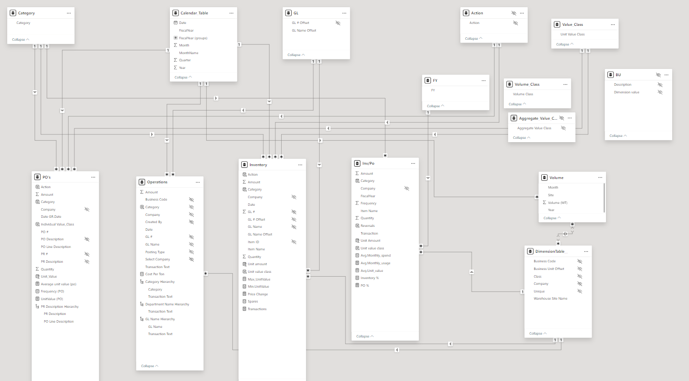  
---
Sample DAX 1         | Sample DAX 2  
:-------------------:|:-----------------:
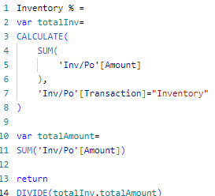       | 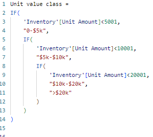 

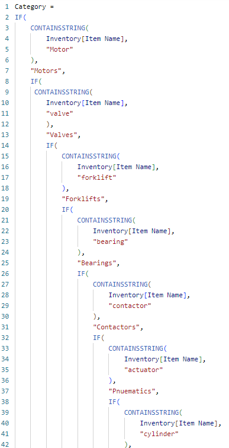 
---
# Visualization
The report comprises of 4 pages:
- Homepage
- Overview
- Usage
- Price trend

## Homepage
Contains buttons at the top right to allow for easy navigation between report pages.
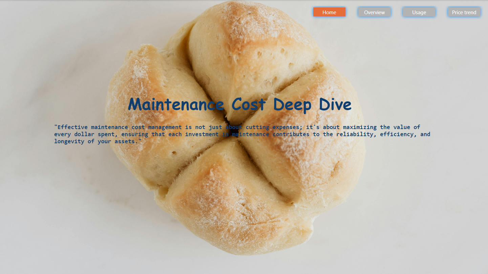

## Overview
A summary of major cost drivers, Inventory vs Purchase orders ratio and maintenance cost per ton trend against volume.
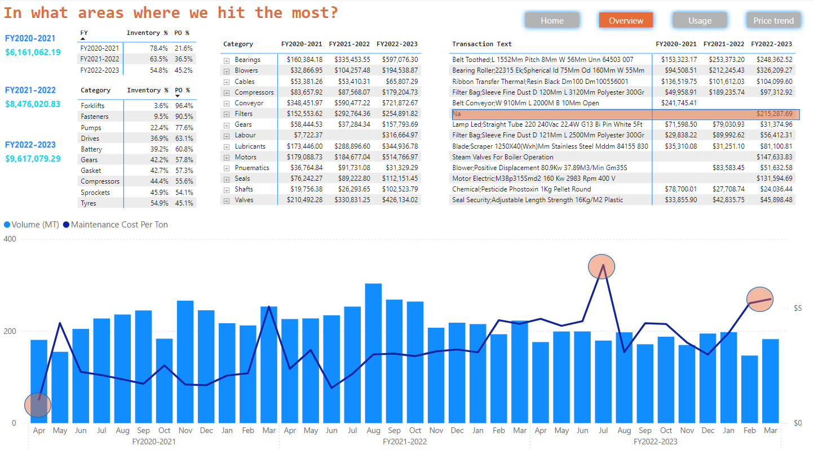

## Usage
An analysis of consumables; exact spares, their volume of usage, the frequency of usage and the amount incurred
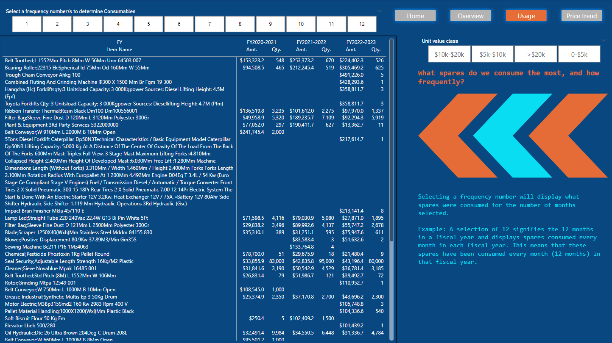

## Price Trend
Analysis of how the unit price of spares have changed over time, with some spares rising way beyond what can be explained by only inflation.
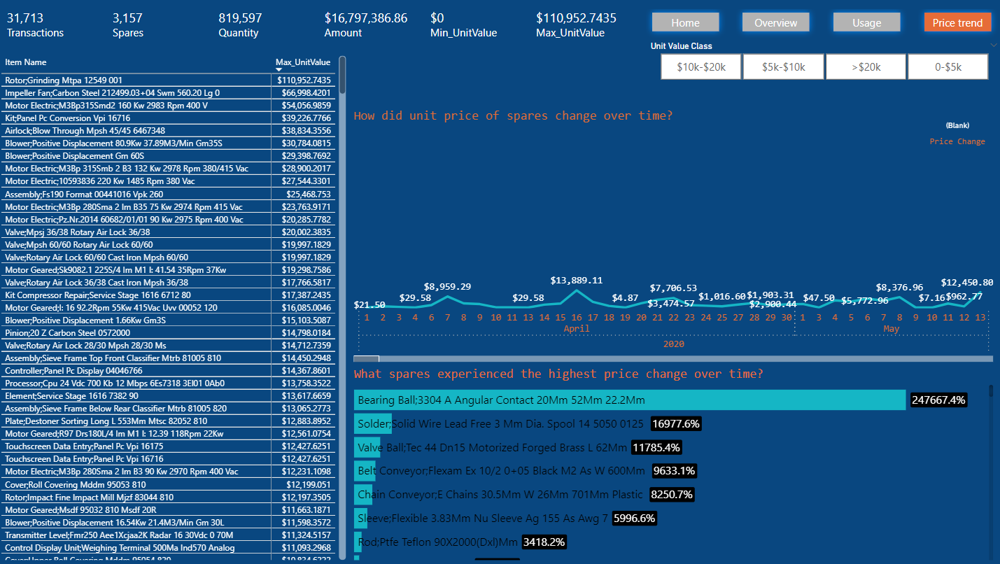
---

# Analysis
This analysis was done with flour production in mind, hence data and analysis have been tailored accordingly. However, this can apply to most manufacturing companies, especially food and beverage.

### Data Issues
Several issues were identified while exploring the data at the source, which includes;
1. Poor requisition process. For example, an item costing $1500 is requisited and later reversed, on requisition the data shows a value of -$1500 but after beign reversed it shows +$0 instead of +$1500
2. Same issue as above with quantity of spare requisited.
3. Lots of transactions made with improper description or no description at all making it difficult to trace what exactly that expense was for.

The table above shows transactions without a description displayed as "NA" amounting to $215k in FY22-23 alone ranking among top 10 transactions in cost.

### Maintenance Cost per Ton
The industry standard maintenance cost per ton in flour milling can vary significantly depending on several factors, including the location, scale of the operation, age and condition of the equipment, and specific processes used in the milling operation. However, some general benchmarks can be provided. Approximate maintenance cost for smaller mills range between $1 to $3 per ton of milled flour, while medium to large mills may have maintenance costs ranging from $0.5 to $1.5 per ton, benefiting from economies of scale and more advanced technology. For a typical, well-maintained flour milling operation, maintenance costs are often budgeted at around 1% to 3% of the total operating costs, with a specific target of $0.5 to $2 per ton of product being a common industry figure.

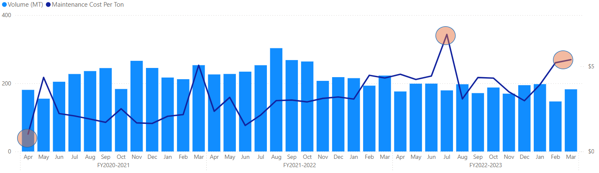

The chart shows a maintenance cost between $1 to $5 in the first fiscal year, $2.4 to $4.5 in the second fiscal year, and $4.5 to $6.9 in FY22-23. This is way above the industry average for medium to large scale operations.
Influencing factors includes geaographic location with high cost of importing spares and economic conditions like high inflation rate, age of equipment and maintenance strategies.

Also, the general downtrend in prodiction volume due to possible economic conditions and inflation leading to lower purchasing power of people and hence lower sales demands did not affect maintenance cost as its expected that both ought to be directly proportional.

### Inventory vs Purchase Orders
The benefits of properly maintaining a stock of critical spare parts, tools, and materials required for equipment maintenance far outweighs the benefits of raising purchase orders when parts, tools, or services are not available in inventory and need to be sourced from external vendors. Urgent orders often come with premium costs, affecting overall budget.

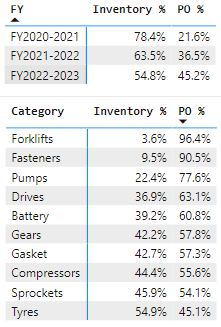

An increase in Purchase orders can be seen from the analysis over the years. Major drivers for this have been categorised and analyzed, with forklifts, fasternes, pumps, drives and battery related spares being top 5 at over 60%

### Most consumed spares and how they drive maintenance cost up
Spares like belts, bearings, ribbons, filters, etc. account for top 5 most requisited items. They are the major cost drivers, with highest in quantity and frequency of requisition, being requisited multiple times in a month and every month in every fiscal year.

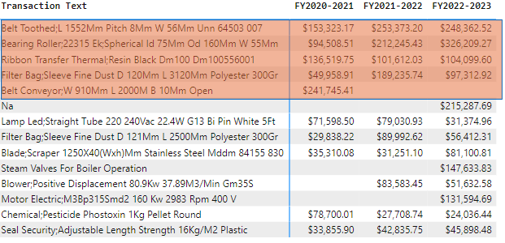
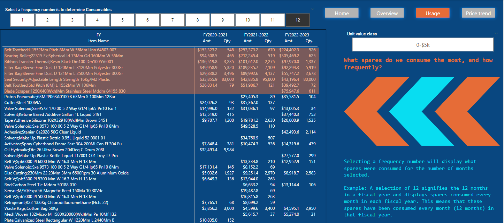

### How has unit price of spares changed over time?
The analysis revealed several spares with ridiculous percentage increase in unit price , some over a very short time frame.

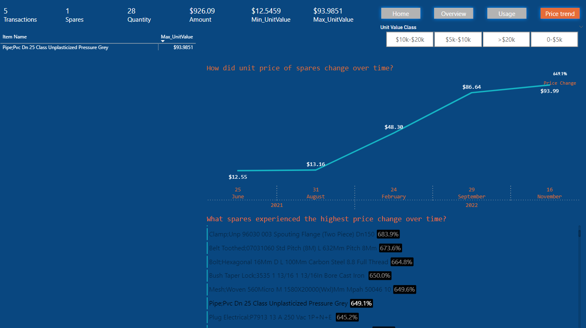

This shows an item (Pipe; pvc DN 25 Class unplasticized pressure grey) with 5 transactions made over 3 years first on June 25th 2021 at a unit price of $12.55 and its most recent transaction 15 months later at $93.99 giving an increase of 649%.
This is beyond inflation and points to requisition issues, supplychain disruption or possible supplier monopolies amongst many ogther possible factors.

# Recommendations
- Keep inventory of high-use, critical components, and rely on purchase orders for non-essential or rarely used parts.
  Improvement is required in Narration /Description as the highest expense as sorted have no detail description ( this should be corrected ASAP-contact ERP)
- Control measures are to be put in place to reduce high consumptions in various categories of spares and consumables like lubricants, bearings, belts, pumps and filters for cost reduction
- Accessment of equipment to establish age as older equipment generally incurs higher maintenance costs due to wear and tear and less efficient operation.
- Wrong Postings and classification are common  -All ERP users should be retrained.
- Postings and approvals should be real time to facilitate accountability and transparency.
- There is need for improvement in lubricant storage, issuing, and usage control. Decanting from drums should be tracked, and quantity used should be entered on the work order and should match what is on the lubrication record.
- Regular Out of Stock Report and Consumption Report should be prepared by Store Manager to Operations Head for improvement
- Personnel is expected to review the company's obsolete list before ordering any spare parts.
- Use data analytics and maintenance history to forecast parts usage and optimize inventory levels.

---

# Thank you for getting to the end, I am very enthusiastic about manufacturing and always seeking out ways to improve processes!
